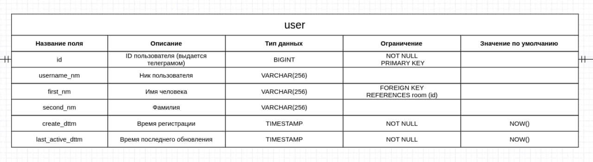
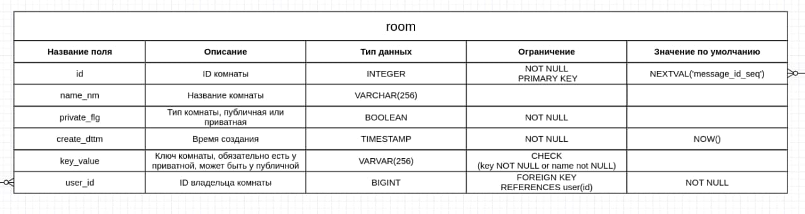

# Курсовая работа по курсу «Базы данных»

*Задача: взять предметную облать, сделать концептуальную, логическую и физическую модели, 
создать их в СУБД, заполнить данными*

[Ссылка](https://vk.com/doc227432747_600751970?hash=0f20c5620f0f205874&dl=75c3d8ed95f0825ca2) на на мануал по выполнению проекта

**Пункт 1**
## Тема: Телеграм бот для хранения публичной и приватной информации от пользователя

## Описание

Объекты (таблица в базе данных)
1. Пользователь (аккаунт в телеграме), имеет имя, username, id и прочее
2. Комната - аналог папки в файловой системе, может быть публичной или приватной
3. Сообщение. Имеет уникальный id, соотносится к сообщению в чате телеграма
4. Контент. Еденица контента, фотография, видео, текст, аудио и прочее

**Пункт 2**

## **Логическая модель**

## **Физические модели**

## Файлы проекта
1. [drop.sql](sql/drop.sql) - DML скрипт для удаления всех объектов из базы данных. Стоит выполнить перед другими запросами
1. **Пункт 3** [create.sql](sql/create.sql) - DML скрипты для создания моделей базы
1. [view.sql](sql/view.sql) - посмотреть список таблиц в базе данных
1. **Пункт 4** [insert.sql](sql/insert.sql) - заполнить таблицы тестовыми данными
1. **Пункт 5** [queries.sql](sql/queries.sql) - запросы к бд, интересная статистика
1. **Пункт 6** [crud.sql](sql/crud.sql) - CRUD запросы таблицам (CREATE, READ, UPDATE, DELETE)
1. **Пункт 7** [views.sql](sql/views.sql) - создание представления для каждой таблицы
1. **Пункт 8** [complex-views.sql](sql/complex-views.sql) - более сложные view представления, используют join
1. **Пункт 9** [triggers.sql](sql/triggers.sql) - триггеры на таблицы
1. **Пункт 10** [procedure.sql](sql/procedure.sql) - создана хранимая процедура
